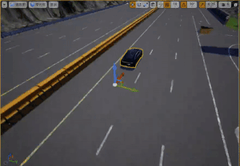
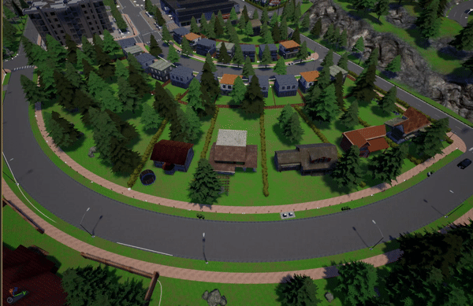
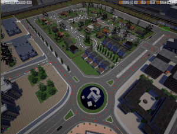

# 效果展示

在复杂的城镇道路环境中，使用模仿学习模仿carla的agent的驾驶行为，为RL学习提供引导

车道线跟随,使用DDPG，能够实现非常长的路程在车道内行驶（因为使用浮点数油门和转向，控制很稳）

车道线跟随A3C_v1 1

车道线跟随A3C_v1 2

多车路径跟随训练A3Cv2

多路径点A3Cv2

单路径点DQNv1

# 设计框架

- 暂未开源

# 框架和RL概念
## 框架设计目的  
1. 去除引擎接口依赖:通过引擎接口将引擎和RL整个项目分离,实现替换引擎后(比如carla替换成AirSim等),所有RL项目内容无需改动,只需要改动对应的引擎接口engineInterface  
2. 减少Env代码冗余:通常一个RL任务对应于一个Env,RL任务存在相似性,因此Env会存在大量冗余代码,所以使用模块化的Action,State,Reward等来构建Env,这些模块化的组件不依赖于engine,只有Env依赖于engine，env是上述组件的组合  
3. Env和Agent的独立和开源兼容:Env需要尽可能按照gym的接口进行实现,保证即使是github上面copy下来的开源算法只要更改了Env就能够立即使用；所有Agent都留出一个Env的输入参数,保证对任何Env，包括gym中的env都能够使用  
4. Model的模块化:Model只依赖于来源机器学习/深度学习等算法框架,作为公用库引用,但是由于算法的特殊性,一些Model是完全只会在一个Agent中被引用的  

## 项目训练入口@./ReinforcementLearning/train
- 存放各个env，结合于不同的agent的RL的训练代码,可以作为项目的入口

## 引擎接口@./engineInterface
- 引擎接口提供车辆生成,接受控制参数,提供车辆信息和地图信息等,EngineInterface中规定所有引擎,如airsim,carla等需要实现的接口,接口文档存放在其中
### 通信频率问题
- 如果引擎和算法在同一个线程（比如gym），则不太会有通信问题。但大多数情况下，引擎和agent是server-client模式，通过rpc等进行通信，如果client调用server的频率过高，则会在server端出现阻塞导致延迟的情况，可以通过减少RL运行频率，减少一个端口，或者减少server同时连接的client的数目来解决（实测通信上是限制并行RL训练能够容纳的agent数目的主要因素） 

## Agent@./ReinforcementLearning/Modules/Agents
- Agent是算法承载的主体,依赖于Model,agent需要和输入的环境Env交互,得到状态State,将状态传入模型Model中,得到模型给出的动作Action,将Action放入Env中得到State,完成一轮循环
### 延迟分析
- RL决策有固定频率，如果保证RL有例如10hz的决策频率，则需要使用工具来衡量agent进行一个循环的耗时，然后sleep相应的秒数，保证决策频率稳定。尤其是当agent是并行或者模型很复杂时，需要评估训练过程的延迟，例如在一个没有并行client在action过后，到下一个循环的用时3ms，如果RL是10hz，那么还需要sleep 97ms。而一个并行的client可能每次间隔20ms，此时需要动态修改等待的时间
## 环境Env@./ReinforcementLearning/Modules/Environments
- 环境响应action，并对state进行模拟，提供state接口，接受action参数
### 接口规定 
- 为和开源代码兼容,所有Environments都实现IEnv中的接口,IEnv和gym.env接口相同,兼容大多数以gym为env的开源算法（有step，reset等方法，step返回new_state,reward,done和action）
### 模块化
- 考虑到迭代可能产生各种RL任务,分别需要的Env种类较多,为尽可能避免代码重复,Env都采用包含Action,Done,Rewards和States等模块的方式构建,目前这些模块设计上是不依赖于Engine的纯计算模块，需要env提供Engine给出的结果
- Env可能有很多任务,比如路径跟随,过红绿灯,多车避障,图像端到端等等,模块化的方式有利于单个任务的测试和任务的集成
- 对于一个Env,需要在构造函数中设置好所有的Action,State等,这样只需要看构造函数即可知env具体内容，
- 可能遇到一个Env需要使用多个State的情况,此时需要Env自己对state合并,而不是新建一个包含两个State和新State
### 并行支持
- 并行进行强化学习的训练对于效率提升很重要，需要环境能够支持并行
- 强化学习的环境需要基于仿真引擎来建立，因此仿真引擎需要支持并行的环境，比如能够开启很多server来提供给算法client进行训练。以carla为例，carla支持在地图中创建多个车辆进行学习（一个车辆被一个agent控制用于学习），同时也能够使用docker在本机创建server通过不同的端口连接，一个端口一个UE环境，一个地图，在局域网内部还可以跨不同的机器进行连接。

## 模型Models@./ReinforcementLearning/Modules/Models
- 纯机器学习或神经网络模型,输入只有Action和State向量的长度,搭建模型,调用时给模型输入Reward,Action,State的batch用于训练，或是给state来从模型中获得action。
- 需要实现存储,载入等方法

## 数据分析工具@./ReinforcementLearning/Modules/DataAnalysisTools
- 用于在线的state，action，reward等数值监测，以及离线数据收集和分析

## ProcessManager@./ReinforcementLearning/Modules/ProcessManager
- 部分agent都需要用到的控制模块,用于给出现在是进行随机action还是使用模型进行选择,以及是否应该进行模型训练和是否应该进行模型存储
- 退火e-greedy算法:以一定概率e进行随机操作,这个概率随着训练步数增加而减小,一开始随机性高,偏广度,之后随机性少,模型得到了充分训练,更为深度

## Archive@./ReinforcementLearning/Archive
- 一个RL任务训练表现较好后,在Archive中创建文件夹,将train的代码复制进去,并带上相应的权重文件,同时增加一个play文件，要求运行play文件能够直接演示。一旦某个train被archive了，涉及到的所有env，agent，env里面的action，state等模块，全部都需要archive，变为readonly

## 模仿学习@./ReinforcementLearning/ImitationLearning
- 模仿学习（IL）是利用已有的数据集，或者另一个成熟算法，指导agent训练或者直接构建agent。
### 模仿学习和强化学习的兼容
- 通常模仿学习的数据集是人类的驾驶行为，因此数据集的y通常是油门、转向的浮点数。而大部分RL的y（也就是action）是离散的（比如左转0.1，左转0.25，右转0.1等这样有限的action），这样的引起回归问题和分类问题的不兼容。
- 但RL大多为分类问题通常是由算法引起的，也有部分能够以回归问题进行的RL算法，这部分算法就能够在模式上和IL兼容。
- 因此可以有这些方式融合IL和RL：  
1.选用一个能够利用回归来进行RL训练的算法  
2.扩展action使其具有一个很大空间（比如转向为0.1, 0.2, 0.3...等），此时需要将IL的数据集的连续的y浮点数也变成action的离散one hot编码
### 离线模仿学习(数据集监督训练)
- 离线IL的数据集是采集的人类行为或者更成熟的算法在模拟过程中的state以及action的数据集（比如从rosbag中拿到的数据集）,然后利用这个训练集训练IL模型从state中得到action。action可以是直接的油门,转向浮点数，甚至可以是PID信息,当然也可以为了兼容RL而编码为离散的几个action类别。
- 用数据集训练得到模型后，这个模型可以直接作为RL的模型，输入state，给出action，但是RL不一定能够训练这个模型（比如之前说到的回归和分类问题不兼容）
- 如果IL的模型能够和RL兼容，并且RL能够优化模型，则IL的模型可以作为预训练模型，能够加快RL的训练。但是一旦在IL中训练完毕，最终的模型就完全是RL的训练结果了。

### 在线模仿学习
- 在线模仿学习就是在RL学习的过程中进行IL，一直影响RL模型的参数。可以通过以下方式实现：  
**1.IL数据集播放**：在RL训练的过程中，用IL的数据集feed到RL的模型中，来更改RL模型的权重，使其具有IL数据集的行为。此时可以通过调节learning rate和训练频率来调节IL在RL中的比例，可以随着时间逐渐从IL过渡到RL，实现引导作用  
**2.伴随RL学习（无需数据集）**：使用并行的几个agent，或者可以临时替换算法的agent，替换或者同时使用IL和RL的算法。IL的算法是成熟的算法，可以是一个ros的节点用于发送消息给其他算法来得到控制信息，也可以是人类控制的键盘，但是IL的agent需要完全遵守RL的action规定输出（可以不需要state信息），IL的行为类似于一个hook，截获env，得到车辆的一些state，然后用其他模型给出action，替换到本应使用RL来给出的action
### IModelHook@/ReinforcementLearning/ImitationLearning/ModelHooks
- 根据上述伴随RL学习的思路，建立一个ModelHook，在一个RL的agent中,另一个算法根据截获的env来得到action替换原来模型的action,然后其他部分全部保持不变,这样就可以把其他算法的行为注入RL中,用于训练RL的模型,实现模仿（模仿学习并不一定能够使RL模型更好，但一定能够使RL行为很像IL的模型的行为）
#### ModelHooks例子
1. 成熟的基于状态机的算法
2. 经过IL数据集训练的机器学习模型
3. carla自带的agent（输入路径点，给出油门转向信息）
4. 对应于RL各个action的手柄、键盘的人类玩家输入（但是人类很可能观察到远远多于env给出的state，引入观测不到的state，给出的action很可能RL模型学习不到）

# 部分算法和实现
- 大部分算法修改自开源代码，建议多看博客了解算法，这里简单记录一些算法思路
## GAIL
- GAIL相当于GAN（生成式对抗网络）+IL（模仿学习）,模仿的对象的数据集用state+action作为X,得到判别器去判断state+action的组合是不是一个高级控制器(或者人类)控制的结果Y(布尔值01分类),然后使用一个生成器去基于state来生成action,生成的state-action作为X来通过判别器鉴定,判别器尽可能优化使得能够将高级控制的结果分为1，将生成器的结果分为0,而生成器则尽可能优化权重使得判别器的输出为1。最终使用生成器来作为模型，给state，输出action
### 流程
1. 获得模仿学习的数据集,state+action数据集{s+a}
2. 以s+a数据集作为X,1作为y构建真实数据{X: s+a , y: 1}
3. 以仿真器中采样的state,或者直接使用模仿学习的state作为生成器的输入,通过生成器得到action,将生成器得到的state+action作为X,以0为y构建虚假数据{X: s -> model -> a,y: 0}
4. 训练生成器使得能够使判别器判别为1,训练判别器使得能够使虚假数据判别为0,这个过程中生成器需要不断生成数据
5. 训练结束以后,用生成器作为模型,在模拟环境env中,给出state,得到模型的action进行测试{X:s, y:a}
6. 上述过程是离线训练的,在线训练可以持续给出真实数据集流(人类行为),持续进行GAIL训练，然后把模型给RL训练,或者交替模型/人类控制.
### 实现步骤
1. 抄一段在图像生成领域优秀的GAN算法
2. 更改网络结构以符合数据集要求
3. 处理数据集
4. 训练

## 纠偏算法的设计方案
RL算法从人类的纠偏行为中学习尤为重要，可以通过以下方法：    
1.RL不进行训练，但是加上人为干涉接口，干涉时收集数据集，离线重点训练（适合RL实车过程）  
2.在RL训练过程中，出现干涉时（通常是使用ModelHook的方式）加大learning rate  
3.在RL训练过程中一直开启和RL模型权重共享的GAIL训练，在GAIL的数据集中批量复制加入干涉时的数据集

## DQN算法概述
- 神经网络输入state，输出和action长度相同的向量，输出向量是分别进行相应的action所获得的收益Q，每次可以贪心取最大的对应的action作为模型给出的建议action
- cost计算：上一个模型输入是readout，是网络根据state得到的每个action的Q值，将这个Q的向量和实际的action相乘（action是one-hot编码），最终得到输出，这个输出将和reward作方差，作为训练误差
- 使用replay memory来存储(state(t),action,state(t+1),reward,done)，一般一次滑动窗口存储多个（实际存储不会存储st+1，而是在采样时加进去）
- 随机从replay memory中拿出样本batch训练神经网络
## A3C算法概述
- DQN是Value-based,而A3C是Value和Policy Based都有,两个模型权重共享(多任务学习)
- Value Based用于预测Reward,Policy Based用于预测各个Action的概率,最终决策是使用概率
- A3C的核心在于loss的计算算法,https://www.cnblogs.com/wangxiaocvpr/p/8110120.html
## 遗传算法概述和流程
- 每辆车直接用NN模型回归到最后的准确操作（如油门，转向，刹车大小，挡位等,注意操作互斥）,而不是到DQN,A3C给出的离散操作(如转向-.25，油门+.25这种)
- 权重的优化使用遗传算法，reward越高，后代这种权重的比例越大，权重会浮点数随机变异
- 参考一个unity引擎中坦克大战的强化学习，每辆车state只有最近敌人的距离角度状态，用NN映射成前进和转弯，以及开炮等，使用遗传算法调整权重,因为一次有很多辆坦克,所以样本量大
- 缺点是优化慢,但是可以在模仿学习得到的预训练模型的基础上优化!
### 流程
1. 获得模仿学习的数据集,训练一个从state直接到油门转向的预训练的模型
2. 使用遗传算法优化模型中的参数

# 运行流程
## 使用docker(推荐)
- 如果没有可视化需求,可以使用docker进行训练,开多个线程,每个线程设置不同的ip和port链接不同的carla仿真环境进行训练,提高训练效率
- carla-docker的安装可以参考carla官方文档,先安装docker,然后安装nividia docker,然后启动,设置map等
- docker的启动脚本见dockerUtils.py，可以同时启动多个server对应不同端口，然后在agent中填上对应主机的ip和对应端口（但是实测每台机器最好只开一个端口，多了存在通信问题）
## 使用可视化的UE
- 安装Carla的PythonAPI和CarlaUE环境(可根据carla官方文档),推荐找已经编译好的carla环境复制(查看"同平台的carla迁移")
- 建议使用Pycharm,建立新的Project并选定此文件夹作为工作目录（若不使用Pycharm，则将此文件夹加入环境变量）
- 启动Carla UE,打开一个map,然后运行或者运行模拟
- 在ReinforcementLearning/train文件夹下运行任意一个脚本来进行测试：需要在相应的参数中填入编译好的PythonAPI路径,以及UE端的ip端口,然后运行
## 可视化UE同平台的carla迁移安装(以Ubuntu16.04相互迁移为例)
- PythonAPI只需要复制carla里面PythonAPI文件夹，然后尝试导入，解决依赖(遇到libpng16依赖可以再复制一下libpng16.so等文件)
- carlaUE需要复制carla整个文件夹，同时复制对应UE引擎，UE运行./Setup.sh，之后双击carlaUE里面的.uproject文件

# 开发流程
## 建议的文件规则
目的:尽可能实现代码的重用,同时保证不同成员修改代码后不会引起冲突  
项目中文件分为三种,Public,MultiAuthor和Private,在文件头部写明  
1. Public里面每个类或函数都没有作者声明要求,可以被任意引用,修改时需要review  
2. MultiAuthor中是每个类有一个作者(如果是函数就请写成静态类),需要在**类成员**中添加变量,一个是Author,另一个是AllowImport(Author代表作者,AllowImport代表作者是否建议其他作者引用自己的模块,通常模块不成熟,会有很大变动时不建议被引用,一旦AllowImport=True,就尽量不要变动太大防止依赖于该模块的受影响)
AllowImport=False**仅仅只是不建议引用**,其他成员开发时有需要可以引用,但如果需要更改,需要原作者review  
3. Private,需要在文件头声明作者,只能作者本人修改其中的代码  

## 建议的RL开发流程
1. 根据任务新建Environment，优先引用现有的action，state等完成env搭建,如果需要修改已有的非自己署名的模块,可以修改后给作者提交review或者提交需求
2. 同样的方法来创建Agent,注意将Model部分放入Models中(推荐在现成开源的算法中修改,封装Agent类)
3. 在Env和Agent的基础上建立一个训练任务,放入train目录,文件声明为Private并署名
4. 自己的文档,TODO,笔记等放在私有的部分(Private文件或者自己署名的类中)
5. 在某个任务Env下训练了一个较好的agent后,可以在Archive目录下放置相应的训练代码,权重文件和用于演示的代码.
### 开源算法的迁移
- 推荐先多看论文，github多搜索，先找现成算法
- github上的RL算法代码大多是采用gym作为Env,因此,大部分的代码copy下来只需要修改env的部分即可,模型可以模块化放在Models中
### 一些开发建议
1. 在搭建完成env过后,强烈推荐先大量测试开源算法agent或者已有的agent,在效果良好的情况下再继续优化,如果大量算法测出来效果不好,可能env中action,state等设置有问题,进行env的debug  
env的debug可以使用DataMonitor观察state，reward等是否和仿真引擎观测到的状态相符，观察的state，action数值范围，变化趋势，分布等是否合理(比如尽可能值域在-1到1，随时间线性的改变，连续)
2. 训练过程中可以使用DataCollector收集数据,然后离线作图分析,包括:  
1.作曲线图观察state-reward，action-reward等的相关性，确保符合设计预期  
2.观察分布:由贝叶斯公式P(action|state) = (P(action)P(state|action))/P(state),如果action设置得当,先验概率P(action)是等概率的,P(state|action)和P(state)可以用DataAnalysis中的工具对收集到的数据作出分布,由此可以验证不同state状态下是否做出了正确的action  
3.边界情况分析:对训练较长时间的模型，固定其他state，只变动一个或两个state，构造state值域内的虚假数据集，预测action，绘制state-action曲线观察模型对于边界state的处理

# 一些经验
很多RL任务开发经验在代码各处注释
## 关于强化学习的任务搭建
- 一个完全的自动驾驶RL模型可能是从图像输入和其他传感器到车辆的最终控制信号,但这样的模型训练需要大量的样本,并且可能很难落地.低风险的方法是将RL应用于一些小场景,在每个场景中达成任务,然后逐步融合State,Action等形成大的任务
- 比如实现输入waypoints给出准确的油门转向控制,输入障碍物信息给出绕障的油门转向,然后将这两个任务结合,搭建路径跟随+绕障的模型
- 一个RL任务会新建一个Environment,并增量更新Action,State等模块
### RL任务迭代例子
1. 单车路径跟随:给一个距离25米的直线，以车辆到直线偏离距离，到终点距离，速度等计算reward，给出state
2. 在1的基础上，进行连续RL，设置好间隔5m的waypoints，每次让车走直线到达下一个waypoint（连续RL体现在到达下一个waypoint后不会结束，而是更新target，同时清空马尔科夫链的状态,与真正的reset相比只有引擎那边车辆位置没有reset,其他都reset）
3. 在2的基础上，加上到达每个waypoint的速度限制，这个速度需要作为reward和state
4. 多车路径跟随:在上面的基础上，添加一定距离内的另一辆车的当前方向角和距离以及另一辆车的速度方向角和距离作为新增的state，可以以车辆距离作为reward，只需要一碰撞就设置为done
5. 多车路径跟随+避障:提供障碍物的信息,仿照多车路径跟随的思路设计
RL任务之间应当是平行的,每次创建新的env时,也需要保留前一个的env

## 可视化UE运行FPS
- carlaUE的libcarla的代码执行频率应当是和UE的FPS相同的,在UE中打开FPS显示,尽可能让FPS高一些,可以通过项目设置中的carla设置进行调整,UE聚焦时windows下FPS能够达到120,非聚焦下70~80,尽可能将摄像头移动到消耗FPS少的地方,比如放大摄像头,移动到草地等
- UE的运行状态非常影响训练效果,因此最好在稳定的运行环境下训练,UE运行时不要最小化它,会因为UE的节省资源行为而出错,最好的方式是将窗口缩小放在能看到的地方
## 多车训练
- 多车同时训练采用多进程或多线程,每个车辆只需要创建一个env,然后采样得到action,state,reward等,然后push给全局模型去训练,之后pull回更新的权重
- 关于python的多进程和多线程参考:http://python.jobbole.com/86822/,因此最好选择多进程而非多线程
- 建议压力测试最大可同时训练的agent数目,并且评估通信延迟,action计算延迟,action到state的延迟等
- 目前的测试发现,模型训练,权重更新以及从UE中通信获取状态的延迟不高,但是多车过后因为通信阻塞的问题,UE端会出现部分车辆没有被控制的现象,可以尝试开几个docker,每个UE端启动几辆车进行训练
- 其他内容见：环境-并行支持

## 路径跟随的蛇形走位问题
- 表现为车辆到路径点横向距离-时间的曲线是明显的振幅增大的周期性曲线,呈发散状态
- 受影响因素:路径点设置间隔(间隔小,曲线频率高),reward,速度控制
### 可能的解决方法:
- 不要使用车辆到路径点距离作为reward的部分(否则会专注于到达waypoint而不是沿着车道行驶);
- 添加车道线的state,并且连续更新;
- 增加转弯的reward负修正;
- 使用车道偏移量y的积累作为reward负修正
- 增加偏移量过大的done条件(也可在有路沿的环境中模拟,偏移量过大撞墙导致速度较低Fail)
- action增加更多控制选择,更加精确
## 几乎没有的速度控制
- 表现为一直保持在初始的油门,基本不会对油门档位进行控制
- 油门的控制与纵向加速度state密切相关,这个state是否对action决策做出了贡献?

## 论文阅读笔记
### Learning to Drive in a Day @https://arxiv.org/pdf/1807.00412.pdf
- 采用的action是速度和转向，设置速度过后使用传统算法将车辆的速度控制为设置的速度，转向和速度都是浮点数！
- 使用的算法是DDPG

