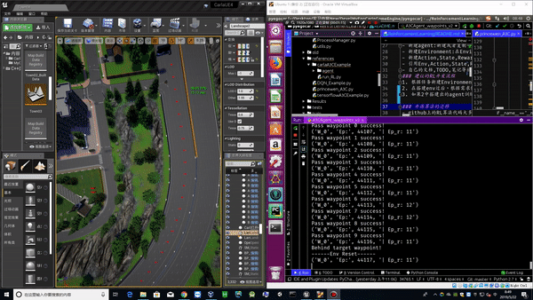
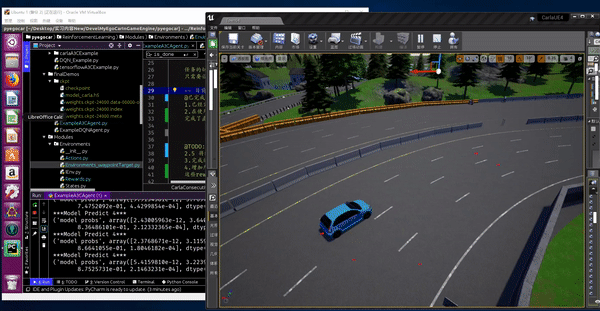
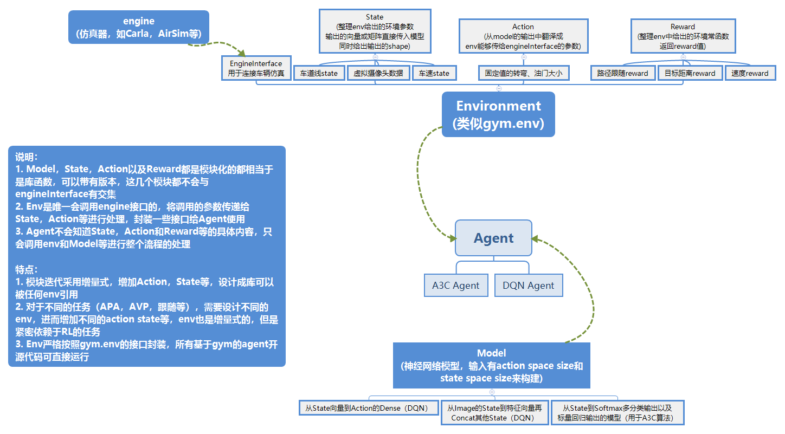

# ReinforcementLearningInAutoPilot

## 效果展示

多路径点A3Cv2

单路径点DQNv1

## 设计框架

- 暂未开源
## 流程记录
- 安装carla仿真环境
- 封装carla的API以方便调用
- 根据RL任务写State，Action，Reward等的算法，注意这些模块输入不依赖于carla API
- 用上面的这些S A R组成Env，Env和gym尽可能相似的接口，env调用carla接口
- 重写开源代码的model和Agent流程，开始训练

## 强化学习任务搭建
- 一个完全的自动驾驶RL模型可能是从图像输入和其他传感器到车辆的最终控制信号,但这样的模型训练需要大量的样本,并且可能很难落地.低风险的方法是将RL应用于一些小场景,在每个场景中达成任务,然后逐步融合State,Action等形成大的任务
- 比如实现输入waypoints给出准确的油门转向控制,输入障碍物信息给出绕障的油门转向,然后将这两个任务结合,搭建路径跟随+绕障的模型
- 一个RL任务会新建一个Environment,并增量更新Action,State等模块
### 单车路径跟随
1. 给一个距离25米的直线，以车辆到直线偏离距离，到终点距离，速度等计算reward，给出state
2. 在1的基础上，进行连续RL，设置好间隔5m的waypoints，每次让车走直线到达下一个waypoint（连续RL体现在到达下一个waypoint后不会结束，而是更新target，继续从当前状态开始，直到到达最终的waypoint才reset，过程中出现了异常就回到最初，因为采用和相邻两个waypoint的垂直距离作为state和reward等的计算依据，因此更改waypoint不会对S和R的计算产生很大变动）
3. 在2的基础上，加上到达每个waypoint的速度限制，这个速度需要作为reward和state
### 多车路径跟随和车联网
1. 在路径跟随的基础上，添加state向量，以另一辆车的当前方向角和距离，另一辆车的速度方向角和距离作为新增的state，不需要以车辆距离作为reward，只需要一碰撞就设置为done（否则可能会和车道线跟随效果的持续reward产生竞争）
2. 需要两个agent进行，初始生成在相邻的车道，同时路径点平行
### 单车避障
1. 可以仿照多车路径跟随的思路设计，也是碰到障碍物之后done
### 单车路径跟随+速度限制
- 在state中添加下一个waypoint速度限制的特征，并修改reward（之前reward是速度越大越好，现在是速度越接近规定值越好），注意，因为速度限制的改变会让reward突变，因此速度改变后应当设置成一个新的RL任务，参考连续RL的思路

## 开源算法的迁移
- github上的RL算法代码大多是采用gym作为Env,因此,大部分的代码copy下来只需要修改env的部分即可,模型可以模块化放在Models中
### 建议的RL debug操作
- 首先确保env的各个数值和仿真引擎的对应没有问题，之后收集训练过程中的数据，分析模型和env中数值内在关系的问题，具体而言:
- 1.在初期调试的时候使用DataMonitor观察state，reward等是否和仿真引擎观测到的状态相符，观察的state，action数值范围，变化趋势，分布等是否合理(比如尽可能值域在-1到1，随时间线性的改变，连续).或者收集数据离线观察
- 2.作曲线图观察state-reward，action-reward等的相关性，确保符合设计预期
- 3.作state-action曲线图检查模型是否做出了符合预期的操作
- 4.单变量分析:对训练较长时间的模型，固定其他state，只变动一个state，构造state值域内的虚假数据集，预测action，绘制state-action曲线观察模型对于边界state的处理
- 5.观察分布:由贝叶斯公式P(action|state) = (P(action)P(state|action))/P(state),如果action设置得当,先验概率P(action)是等概率的,P(state|action)和P(state)可以用DataAnalysis中的工具对收集到的数据作出分布,由此可以验证不同state状态下是否做出了正确的action

## 模块和RL的概念
### ./engineInterface
- 引擎接口提供车辆生成,接受控制参数,提供车辆信息和地图信息等,EngineInterface中规定所有引擎,如airsim,carla等需要实现的接口,接口文档存放在其中
### ./ReinforcementLearning/train
- 通常存放RL的agent,agent需要和环境Env交互,得到状态State,将状态传入模型Model中,得到模型给出的动作Action,将Action放入Env中得到State,完成一轮循环
### 环境Env@./ReinforcementLearning/Modules/Environments
- 为和开源代码兼容,所有Environments都实现IEnv中的接口,IEnv和gym.env接口相同,兼容大多数以gym为env的开源算法
- 考虑到迭代可能产生各种RL任务,分别需要的Env种类较多,为尽可能避免代码重复,Env都采用引用Action,Done,Rewards和States等模块的方式组成
- Action,Done,Rewards和States等都是不依赖于Engine的纯计算模块
- Env可能有很多任务,比如路径跟随,过红绿灯,多车避障,图像端到端等等,模块化的方式有利于单个任务的测试和任务的集成
### 模型Models@./ReinforcementLearning/Modules/Models
- 纯机器学习或神经网络模型,输入只有Action和State向量的长度,用于搭建模型,调用时给出Reward,Action,State的batch用于训练
- 需要实现存储,载入等方法
### 数据分析工具@@./ReinforcementLearning/Modules/DataAnalysisTools
- 用于在线的state，action，reward等数值监测，以及离线数据收集和分析
### ProcessManager@./ReinforcementLearning/Modules/ProcessManager
- 每个agent都需要用到的控制模块,给出随机进行action选择还是使用模型进行选择,是否应该进行训练,是否应该进行模型存储
- 退火e-greedy算法:以一定概率e进行随机操作,这个概率随着训练步数增加而减小,一开始随机性高,偏广度,之后随机性少,模型得到了充分训练,更为深度
### Archive@./ReinforcementLearning/Archive
- 一个RL任务训练表现较好后,在Archive中创建文件夹,将agent的代码复制进去,并带上相应的权重文件,要求运行agent时是演示而不进行训练

## 算法-模仿学习
### 模仿学习数据集和预训练模型
- 模仿学习是采用人类行为或者更成熟的算法根据state以及给出的action作为数据集,训练模型从state中得到action.action可以是直接的油门,转向甚至PID信息,也可以是处理过后的离散数据如左转,加速,减速等
- 数据来源可以是rosbag或者仿真器
- 对于rosbag或者仿真器,提取出需要的state和action,需要和仿真环境env中可以得到的state以及可以应用的action对应!

### GAIL算法概述和流程
- IL是模仿学习(Imitation Learning),GAIL相当于GAN+IL,模仿的对象的数据集是state+action作为X,得到判别器去判断state+action的组合是不是一个高级控制器(或者人类)控制的结果Y(二分类),然后使用一个生成器去基于state来生成action,得到的state-action对需要通过判别器鉴定,判别器尽可能优化使得能够区分出哪些是人类的操作,哪些是生成器给出的操作,生成器则尽可能得到能够让判别器认为是人类操作的state-action
#### GAIL开发流程
1. 获得模仿学习的数据集,state+action数据集{s+a}
2. 以s+a数据集作为X,1作为y构建真实数据{X: s+a , y: 1}
3. 以仿真器中采样的state,或者直接使用模仿学习的state作为生成器的输入,通过生成器得到action,将生成器得到的state+action作为X,以0为y构建虚假数据{X: s -> model -> a,y: 0}
4. 训练生成器使得能够使判别器判别为1,训练判别器使得能够使虚假数据判别为0,这个过程中生成器需要不断生成数据
5. 训练结束以后,用生成器作为模型,在模拟环境env中,给出state,得到模型的action进行测试{X:s, y:a}
6. 上述过程是离线训练的,在线训练可以持续给出真实数据集(人类行为纠正),持续进行GAIL训练,持续进行模型训练,或者交替模型/人类控制.

## 算法-强化学习
### DQN算法概述
- 神经网络输入state，输出和action长度相同的向量，输出向量是分别进行相应的action所获得的收益Q，每次可以贪心取最大的对应的action作为模型给出的建议action
- cost计算：上一个模型输入是readout，是网络根据state得到的每个action的Q值，将这个Q的向量和实际的action相乘（action是one-hot编码），最终得到输出，这个输出将和reward作方差，作为训练误差
- 使用replay memory来存储(state(t),action,state(t+1),reward,done)，一般一次滑动窗口存储多个（实际存储不会存储st+1，而是在采样时加进去）
- 随机从replay memory中拿出样本batch训练神经网络
### A3C算法概述
- DQN是Value-based,而A3C是Value和Policy Based都有,两个模型权重共享(多任务学习)
- Value Based用于预测Reward,Policy Based用于预测各个Action的概率,最终决策是使用概率
- A3C的网络模型框架很简单,核心在于loss的计算算法
### 遗传算法概述和流程
- 每辆车直接用NN模型回归到最后的准确操作（如油门，转向，刹车大小，挡位等,注意操作互斥）,而不是到DQN,A3C的离散操作(如转向-.25，油门+.25这种)
- 权重的优化使用遗传算法，reward越高，后代这种权重的比例越大，权重会浮点数随机变异
- 参考一个unity引擎中坦克大战的强化学习，每辆车state只有最近敌人的距离角度状态，用NN映射成前进和转弯，以及开炮等，使用遗传算法调整权重,因为一次有很多辆坦克,所以样本量大
- 缺点是优化慢,但是可以在模仿学习得到的预训练模型的基础上优化!
#### 流程
1. 获得模仿学习的数据集,训练一个从state直接到油门转向的预训练的模型
2. 使用遗传算法优化模型中的参数
