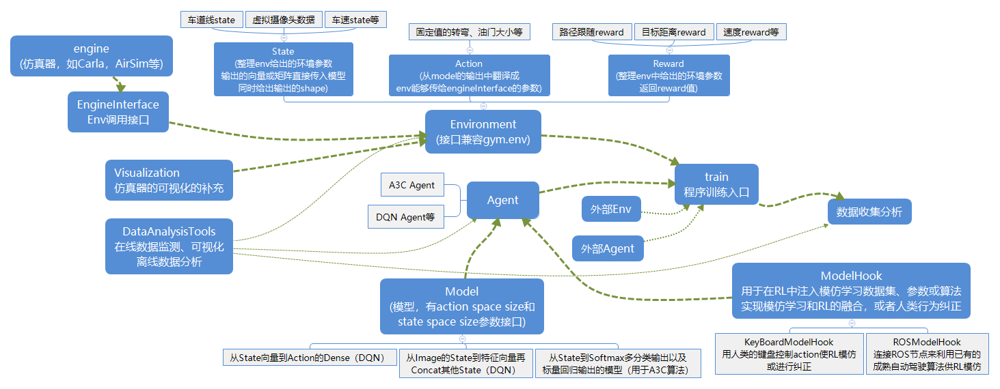

# ReinforcementLearningInAutoPilot

## 效果展示

多路径点A3Cv2

单路径点DQNv1

## 设计框架

- 暂未开源
## 流程记录
- 安装carla仿真环境
- 封装carla的API以方便调用
- 根据RL任务写State，Action，Reward等的算法，注意这些模块输入不依赖于carla API
- 用上面的这些S A R组成Env，Env和gym尽可能相似的接口，env调用carla接口
- 重写开源代码的model和Agent流程，开始训练

## RL任务
- 进行RL是递进的过程，从简单任务逐渐到复杂任务
### 单车路径跟随
1. 给一个距离25米的直线，以车辆到直线偏离距离，到终点距离，速度等计算reward，给出state
2. 在1的基础上，进行连续RL，设置好间隔5m的waypoints，每次让车走直线到达下一个waypoint（连续RL体现在到达下一个waypoint后不会结束，而是更新target，继续从当前状态开始，直到到达最终的waypoint才reset，过程中出现了异常就回到最初，因为采用和相邻两个waypoint的垂直距离作为state和reward等的计算依据，因此更改waypoint不会对S和R的计算产生很大变动）
3. 在2的基础上，加上到达每个waypoint的速度限制，这个速度需要作为reward和state
### 多车路径跟随和车联网
1. 在路径跟随的基础上，添加state向量，以另一辆车的当前方向角和距离，另一辆车的速度方向角和距离作为新增的state，不需要以车辆距离作为reward，只需要一碰撞就设置为done（否则可能会和车道线跟随效果的持续reward产生竞争）
2. 需要两个agent进行，初始生成在相邻的车道，同时路径点平行
### 单车避障
1. 可以仿照多车路径跟随的思路设计，也是碰到障碍物之后done
### 单车路径跟随+速度限制
- 在state中添加下一个waypoint速度限制的特征，并修改reward（之前reward是速度越大越好，现在是速度越接近规定值越好），注意，因为速度限制的改变会让reward突变，因此速度改变后应当设置成一个新的RL任务，参考连续RL的思路